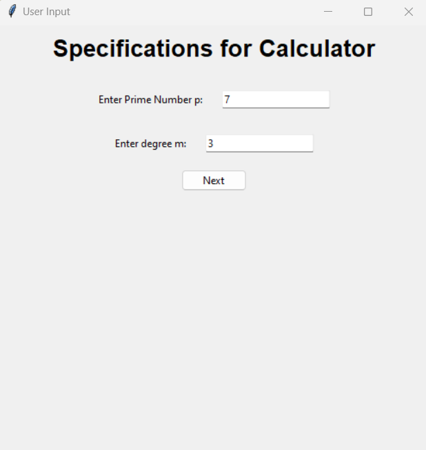
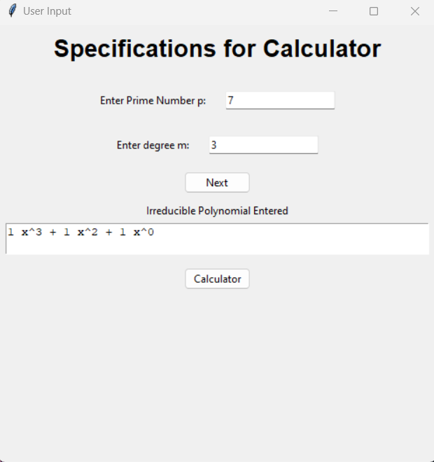
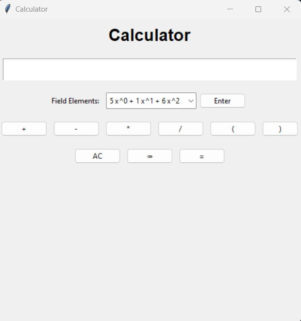
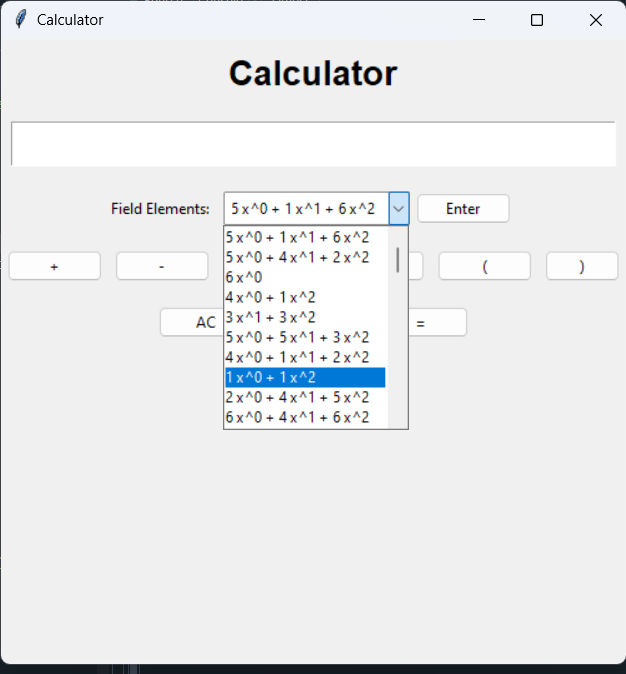
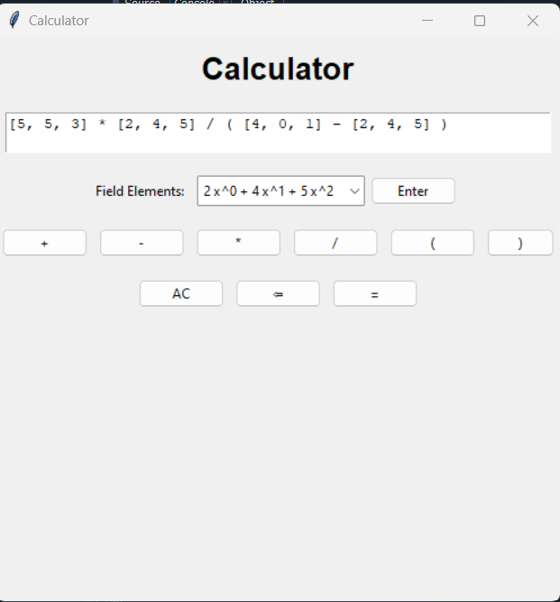
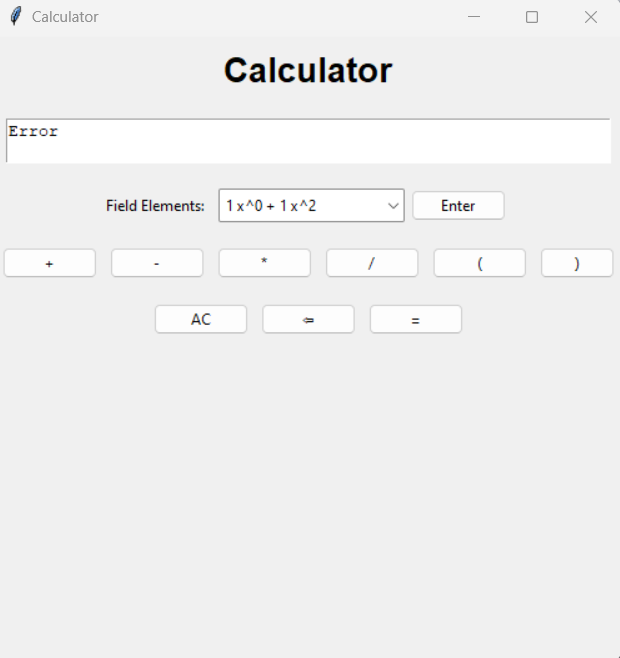

This is a finite field emulator that functions as an arithmetic calculator for polynomials in the field Fpm
## Tech Stack
**Python**: The program has been written entirely in Python. The GUI has been created using the library Tkinter

## How to Run
- Download the [main.exe](https://github.com/AnyaAlekar/Finite-Field-Emulator/blob/main/main.exe)
  

- Run the downloaded file on your machine (Windows)
- The application is ready to use

## GUI

1

## Working
- The program takes as input a prime number p, an integer m, and an irreducible polynomial of degree m in the field Fp
- Next, the program presents to the user a dropdown list of all polynomials in the field Fpm i.e. polynomials of degree less than m in field Fp
- The user can choose from the field elements and operators and enter an expression for the calculator to parse.
- The calculator displays the resulting polynomial on the screen.

## Error Detection

- The parser detects an invalid expression, for example, unbalanced parenthesis, zero division, etc.

## Update (Display Multiplication Table)

- The display button generates a multiplication table showcasing the products of various field elements with every other field element

